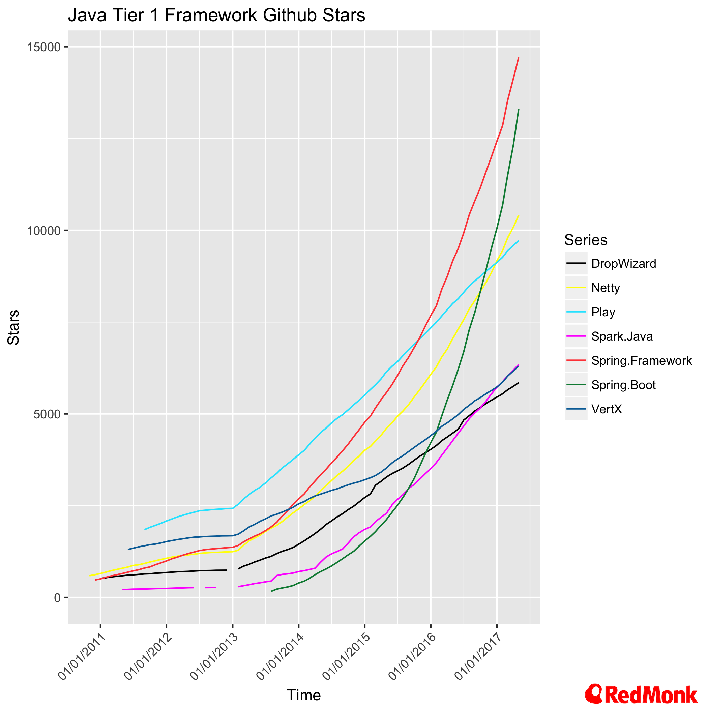
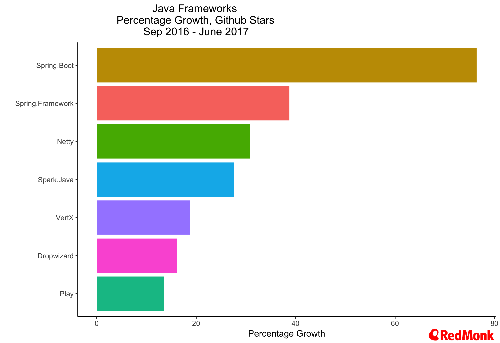
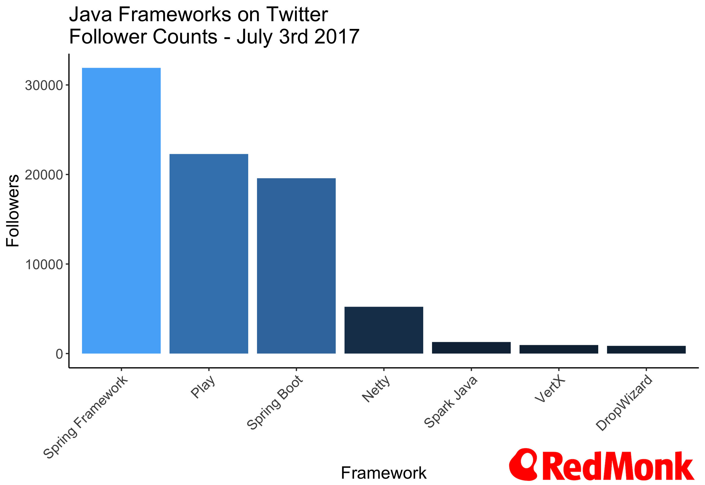
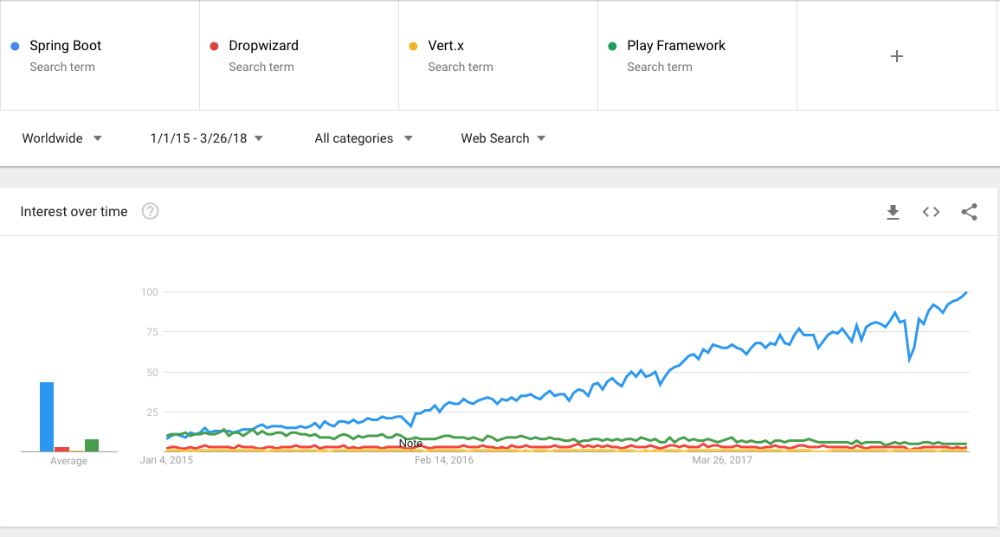
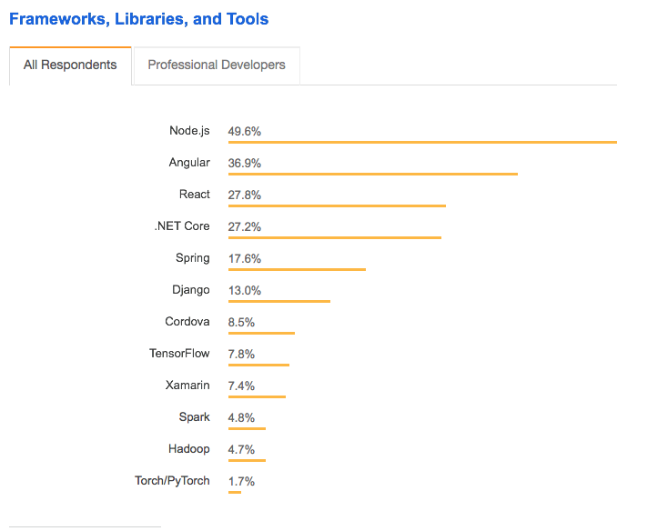
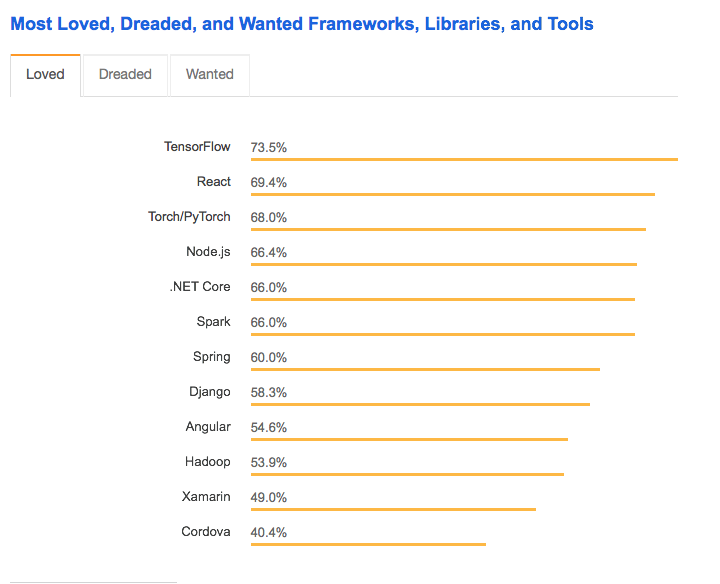

= Referanse-arkitektur
Bent André Solheim, Aurora OpenShift
2018-02-13

== Hvorfor referanse arkitektur?
* Forespørsel fra prosjektene om retningslinjer
* Hensiktsmessig mtp. hand over fra prosjekt til linje
* Basert på erfaring fra tidligere prosjekter
* Redusere variasjon i teknisk plattform

== Hvorfor Spring Boot?
(Bekreftelsestendens)

== Kriterier for valg
* Java
* Cloud Native, Micro service arkitektur*
* Populært (likt av mange)
* Moment
* Godt og aktivt miljø og økosystem

== Cloud Native (fra Twelve factor)
* Processes: Execute the app as one or more stateless processes
* Concurrency: Scale out via the process model
* Disposability: Maximize robustness with fast startup and graceful shutdown
* Config: Store config in the environment
* Build, release, run: Strictly separate build and run stages

== Micro service arkitektur
* Mange mindre applikasjoner
* Redusere boilerplate pr. app
* Unngå hjemmelagede "mikrorammeverk"

== Alternativer
* Spring Boot
* Dropwizard
* Vert.x
* Play Framework
* Spark

== Github Stjerner

== Github Stjerner Vekst

== Twitter Followers

== Google Trends

== Stack Overflow Survey (2018)

== Stack Overflow Survey (2018)

== Thoughtworks Tech Radar (2017)

image::images/ThoughtWorks1.png[TW,,700]

== (Kilder)
* http://redmonk.com/fryan/2017/06/22/language-framework-popularity-a-look-at-java-june-2017/
* https://insights.stackoverflow.com/survey/2018/
* https://www.thoughtworks.com/radar/languages-and-frameworks/spring-boot
* https://trends.google.com/trends/explore?date=2015-01-01%202018-03-26&q=Spring%20Boot,Dropwizard,Vert.x,Play%20Framework

== Øvrig
* Stort økosystem
* Integrasjoner
* Kommersiell backing (Pivotal)

== Skatteetatens referanseapplikasjon
* link:https://github.com/Skatteetaten/openshift-reference-springboot-server[github.com/Skatteetaten/openshift-reference-springboot-server]
* Basert på Spring Boot
* Tilrettelagt for deploy mot OpenShift
* Tilfredsstiller mange ikkefunksjonelle-krav
* Øvrig anbefalt oppsett
* Egen starter aurora-spring-boot2-starter
* Eksempler

== Ikkefunksjonelle krav
* Leveransepakke (til Docker Image)
* Konfigurerer logging (logpattern, fillogging)
* HTTP headere (Korrelasjonsid, Klientid, Meldingsid)
* Eksponerer management interface (/info /health) på egen port basert på actuator
* Checkstyle og Sonar

== Annet
* Konfigurerer opplasting til Nexus
* Setter opp prometheus metrikker
* Enhetstesting med Spock
* Dokumentasjon med Spring Rest Doc
* Versjonering med Aurora CD-plugin
* Jenkinsfile med standard pipeline script for bygging på Jenkins
* Maven plugins (sonar, jacoco, pitest, checkstyle)

== aurora-spring-boot2-starter
* link:https://github.com/Skatteetaten/aurora-springboot2-starter[github.com/Skatteetaten/aurora-springboot2-starter]
* Registrerer filter for HTTP headere
* Lager property sources for Aurora konfigurasjonsfiler
* Graceful shutdown for Tomcat
* Setter properties for managementinterfacet
* Konfigurerer metrics
* Innlesning av databasekonfigurasjon
* Setter standard Spring Boot properties

== Hva dekkes ikke?
* OpenShift
* Jenkins + Jenkins Pipelinescript
* Aurora CD Plugin
* Spring Rest Doc
* Spock
* Systemtest
* Gatlin

== Demo
* Klone refapp fra GitHub
* Inspisere koden

:revnumber: {project-version}