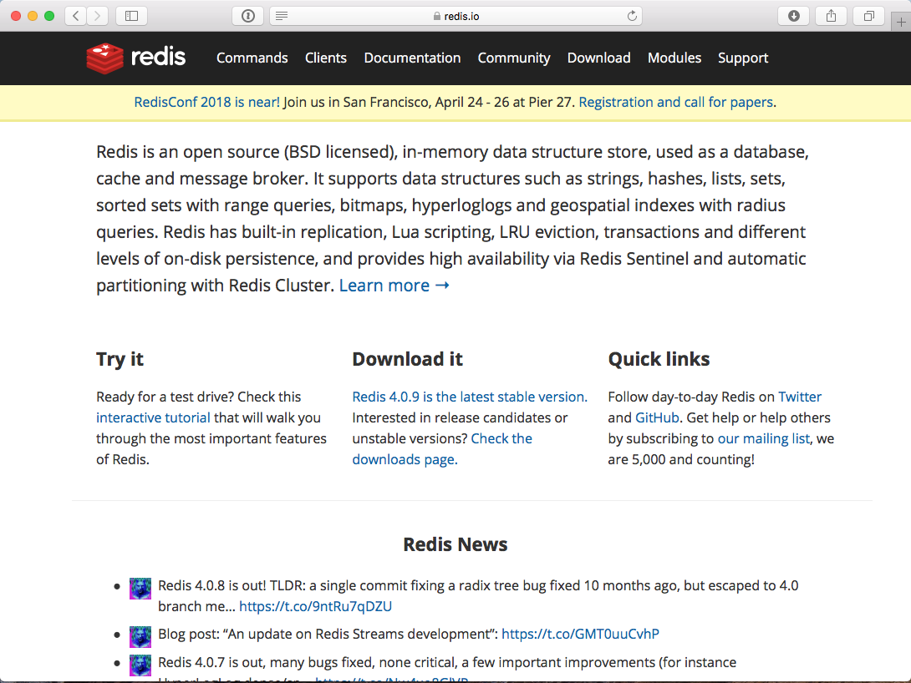

= Intro til Spring Boot
Bent André Solheim, Aurora OpenShift
2018-02-13

:revnumber: {project-version}

== Tema
* Spring og Spring Boot Basics
* Webapplikasjon (HTTP-API) + RestTemplate
* Caching
* Databaseaksess (JDBC + JPA, migreringer)
* Actuator, Helseendepunkt, Metrikker
* Testing
//* Dev Tools

== Forutsetninger
* Forstå grunnleggende begreper som DI (Dependency Injection), Classpath scanning, Application Lifecycle.
* Forståelse av virkemåten og oppbygningen til tradisjonelle java webapplikasjoner (.war, servlet container).
* Maven, JDBC, JPA, Cache, ReST, JSON, Hibernate, DataSource, JUnit, Mockito, Slf4j, Logback

== Hva dekkes ikke?
* JAX-RS + Jersey
* WebFlux
* Spring Security
* Spring Rest Doc (brukes i refapp)

== Hva er Spring Boot?
* Bootstraprammeverk
* Konvensjoner
* Autoconfiguration fra classpath (non-invasive)
* Forskjellige startere

== pom.xml

[source,xml]
----
<dependencies>
    <dependency>
        <groupId>org.springframework.boot</groupId>
        <artifactId>spring-boot-starter</artifactId>
    </dependency>
</dependencies>

<build>
    <plugins>
        <plugin>
            <groupId>org.springframework.boot</groupId>
            <artifactId>spring-boot-maven-plugin</artifactId>
        </plugin>
    </plugins>
</build>
----

== DemoApplication.java
[source,java]
----
@SpringBootApplication
public class DemoApplication {

    public static void main(String[] args) {

        SpringApplication.run(DemoApplication.class, args);
    }
}
----

== Demo
Studere en minimal Spring Boot applikasjon

* Classpath scanning
* Dependency Injection
* Konfigurasjon (relaxed binding)
* Logging
//* Application Lifecycle

== Basics, oppsummering
* Classpath scanning for automatisk Dependency Injection
* Konfigurasjon; defaults, profiler og overrides
* SLF4J og LogBack

== Webapp (HTTP-API)
* spring-boot-starter-web
** Spring MVC (tilsvarer JAX-RS)
** Tomcat
** Jackson
** javax.validation (hibernate-validator)
* maven
** executable jar med embedded servlet container

== Spring MVC
* Bygget på Servletstacken
* Vært i Spring "siden starten"
* Bygget opp rundt DispatcherServlet (tar imot alle forespørseler)
* Controllere annoteres i forhold til http path og method (GET, POST...)
* (Finnes siden Spring 5 også et reactive alternativ; Spring WebFlux)

== Demo
* Enkelt "ReST"-API (@Controller og @RestController)
* GET med request parameters (@GetMapping)
* Json response
* POST, deserialisering av payload + validering (@PostMapping, @Valid)
* Feilhåndtering (@ControllerAdvice)
* RestTemplate + @Configuration/@Bean

== Web, oppsummering
* Embedded servlet container (tomcat)
* Ferdigkonfigurert med javax.validation og Jackson
* Bruker Spring MVC som default
* Content Negotiation, feilhåndtering

== Caching
* Legge på caching transparent på metodenivå
* Skrus på med @EnableCaching
* @Cachable, @CacheEvict
* Cachenøkkel genereres fra metodeparametre
* spring-boot-starter-cache
* JCache, EhCache, Hazelcast, Inifispan, Couchbase, Redis, Caffeine, Simple

== Demo
* Skru på caching for /hello
* @CacheEvict for POST /greeter
* Simple Cache
* Redis

== Redis

== Caching, oppsummering
* Skrus på med @EnableCaching
* @Cachable, @CacheEvict
* Støtter mange Cache Providers

== Databaseaksess med spring boot
* JDBC
* migreringer
* JPA

== JDBC
spring-boot-starter-jdbc

* Datasource med Hikari
* Spring JDBC

== Migreringer
org.flywaydb:flyway-core

* Flyway
* Auto configuration

== Demo ==
* Enkel app med Spring JDBC
* Migrering

== JPA
spring-boot-starter-data-jpa

* Hibernate
* Spring Data JPA
* Repository

== Oppsummering database
* Automatisk DataSource
* God støtte for vanlig SQL/JDBC
* God støtte for JPA via Spring Data
* Automatisk eksekvering av databasemigreringer

== Actuator
* "Management Interface"
* Egen port

== Helseendepunkt
* Avgjøre om applikasjonen fungerer som den skal
* Standardsjekker for mange teknologier
* Lett å legge på egne sjekker

== Demo ==
* Legge på actuator støtte
* Se på de ulike endepunktene (spesielt /health og /info)
* Legge på info i /info-endepunktet
* Lage en egen helsesjekk

== Actuator oppsummering ==

== Metrikker
* Instrumentering av applikasjonen
* Kommer med når man tar inn actuator
* Micrometer (slf4j for metrikker)
* Dimensional metrics

    http_server_requests_seconds_count{method="GET",status="200",uri="/actuator/health",} 10.0

* Støtte for det fleste populære metrikksystemer: *Prometheus*, Netflix Atlas, CloudWatch, Datadog, Graphite, Ganglia, JMX, Influx/Telegraf, New Relic, StatsD, SignalFx, and Wavefront.
* Automatisk scraping på OpenShift

== Metrikker, automatisk støtte for
* jvm metrics (heap, threads, gc, max, min, current)
* logback (logghendelser pr level)
* tomcat (bytes sent/received, threads, requests, sessions ++)
* DataSource (hikari)
* Innkomne og utgående forespørsler

== Demo ==
* Se på standardmetrikkene
* Lage endepunkt som legger på custom metrics
* Se på prometheus integrasjonen
* Metrikker for utgående trafikk
* Unngå "High cardinality metrics"

== Metrikker oppsummering ==

== Testing
* Unngå å bruke spring til testing
* Testing av databasekode (testdatabase)
* Testing av controllere (web slice)
* Mocking av eksterne tjenester
* @MockBean, @SpringBootTest, @WebMvcTest, @RestClientTest
* Mockito

== Demo ==
* Bruke h2 til å teste database
* Se på testspesifikke databasemigreringer
* Teste controllere direkte og gjennom http
* Mocke ekstern tjeneste

== Testing oppsummering ==

== Neste
link:ref-app.html[Referansearkitektur]